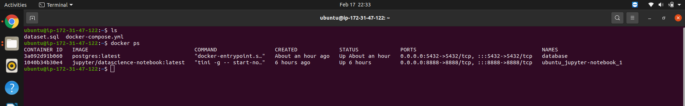
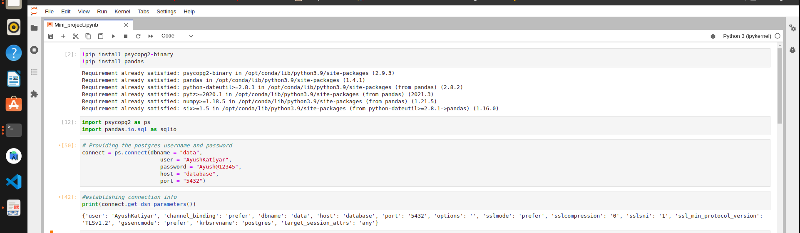
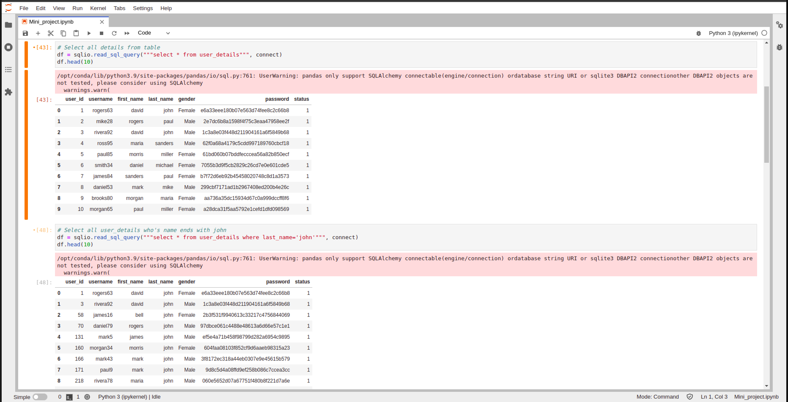
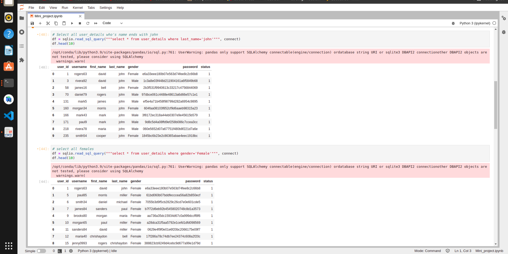

AWS-Aganitha-MiniProject
============
Problem Statement
============
Mini-Project to study the working of the AWS --
* Setup Postgres in a docker container and import any dataset of your liking into it
* Setup Jupyter in another docker container
* Write a notebook using #1, connecting to the Postgres database set up in #2 without hardcoding the latter's IP address, explore the data in the database by executing SQL queries.

-----------
Result
-----------

 (Images of containers)

 (Setup connection)
 

(Query results)
 

-----------
Project's Resources 
----------------
-> Notebook:https://github.com/ayush505/AWS_Aganitha_Assignment/blob/main/Outcome/Mini_project.ipynb
->Projects Link: https://github.com/ayush505/AWS_Aganitha_Assignment

